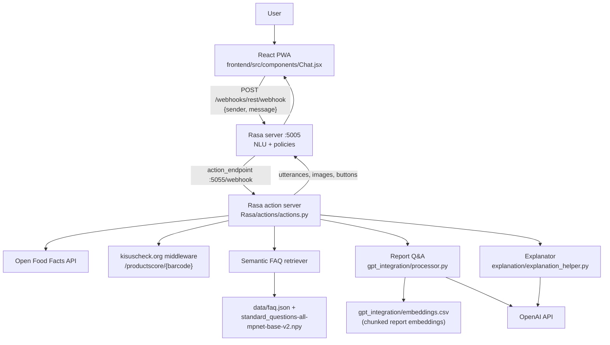

# KI-SusCheck

*A conversational assistant that helps shoppers make healthier, fairer and more sustainable food choices.*

KI-SusCheck ("Eco") is an English-language chatbot that answers questions about food products and
sustainable nutrition. It combines a Rasa dialogue backend — intent classification, slot-filling
forms and ~30 custom actions — with live product data from Open Food Facts, a semantic FAQ
retriever built on sentence-transformer embeddings, and LLM-based answer generation over a
sustainability report knowledge base. The React frontend is a lightweight PWA chat widget that
talks to Rasa over the REST channel.

---

## Overview

The assistant reasons about a product from four sustainability perspectives — **health, social,
environment and animal welfare** — and can:

- look a product up by **barcode** or by **name**,
- report its animal-friendliness, social impact, nutritional value and environmental impact,
- fetch and explain the **KISus-Score** (a composite sustainability score served by the project's
  own middleware at `kisuscheck.org/middleware/productscore/<barcode>`), alongside Nutri-Score,
  NOVA group and Eco-Score from Open Food Facts,
- **compare several products** through a slot-filling form and rank them by KISus-Score,
- remember **user preferences** (ingredients, allergens, nutritional values, food processing,
  labels, environmental criteria) and personalise its answers,
- answer **free-form FAQs** about sustainable nutrition via semantic retrieval over a curated
  368-entry FAQ base,
- answer questions grounded in a **sustainability report** (FiBL/KErn base-concept report) using
  chunked embeddings and retrieval-augmented generation.

## Features

| Capability | How it works |
| --- | --- |
| Intent & entity understanding | Rasa NLU pipeline with spaCy `en_core_web_lg` features + DIET classifier |
| Product lookup | Open Food Facts API v0/v2, keyed by barcode |
| KISus-Score | REST call to the project middleware, merged with Open Food Facts fields |
| Product comparison | `product_comparison_form` + comparison-list slots, ranked output |
| Preference memory | six lookup-table-backed preference slots |
| 🔍 Semantic FAQ | `sentence-transformers` **all-mpnet-base-v2** embeddings, cosine similarity, 0.80 threshold |
| 📄 Report Q&A | text chunking with `tiktoken`, OpenAI `text-embedding-ada-002`, top-5 retrieval, `gpt-3.5-turbo` answer |
| 💬 Answer phrasing | `gpt-3.5-turbo` rewrites deterministic facts into natural, question-aligned replies |
| Explanations | `Explanator` prompt template that explains a KISus-Score or a comparison result, including input-data completeness |

## Architecture



### Semantic FAQ retrieval

`ActionGetFAQAnswer` loads `data/faq.json` (368 question/answer records, some with images and
source links) and the pre-computed matrix `data/standard_questions-all-mpnet-base-v2.npy`. At
runtime the user utterance is encoded with `SentenceTransformer('all-mpnet-base-v2')`, compared to
every stored question with `util.cos_sim`, and the top match is returned if its rescaled score
exceeds `score_threshold = 0.80`. Below the threshold the bot admits it does not know and offers
external references. The `.npy` matrix is regenerated with the module-level helper
`encode_standard_question(pretrained_model)`.

## Tech Stack

| Layer | Technology |
| --- | --- |
| Dialogue management | Rasa Open Source 3.x, `rasa_sdk` 3.6.1 |
| NLU pipeline | SpacyNLP (`en_core_web_lg`), DIETClassifier (150 epochs), ResponseSelector, RegexEntityExtractor, FallbackClassifier (threshold 0.3) |
| Embeddings | `sentence_transformers` 2.2.2 (`all-mpnet-base-v2`), PyTorch 2.0.1 |
| LLM integration | `openai` 0.27.8 (`gpt-3.5-turbo`, `text-embedding-ada-002`), `tiktoken` 0.4.0 |
| Document processing | `python_docx` 0.8.11 |
| Data | pandas, NumPy, `requests` |
| Config | `python-dotenv` 1.0.0 |
| Frontend | React 18, react-scripts 5, Tailwind CSS 3, react-icons, Workbox service worker |

## Conversation Design

- **37 intents** in `Rasa/data/nlu.yml`, including `greet`, `faq`, `scan_barcode`,
  `ask_about_animal_friendliness_of_product`, `ask_about_social_impact_of_a_product`,
  `ask_about_nutritional_value_of_a_product`, `ask_about_environmental_impact_of_a_product`,
  `start_product_comparison`, `calculate_kisusscore_by_barcode`, `scan_sustainability_report`,
  `ask_for_explanation_of_kisusscore_or_comparison_result` and the preference-setting intents.
- **11 entities**: `barcode`, `user_name`, `food`, `food_property`, `preference_type` and the six
  `*_preference` entities, backed by 6 lookup tables plus a product-name lookup
  (`data/lookups/product_name.txt`).
- **52 stories** in `data/stories.yml` and 12 rules in `data/rules.yml`.
- **One form**: `product_comparison_form`, validated by `ValidateProductComparisonForm`.

### Custom actions (selection)

| Action | Purpose |
| --- | --- |
| `action_get_product_info_by_barcode` / `action_get_top_product_info_by_name` | Product lookup |
| `action_get_product_animal_friendliness_info` | Vegan / vegetarian / palm-oil assessment |
| `action_get_product_social_impact_info` | Social dimension |
| `action_get_product_nutritional_value_info` | Health dimension |
| `action_get_product_environmental_impact_info` | Environmental dimension |
| `action_check_*_alternative` / `action_suggest_*_alternative` | Find better alternatives per dimension |
| `action_calculate_kisusscore_by_barcode` | Fetch and render the KISus-Score |
| `action_compare_products_by_barcode`, `action_show_product_comparison_list` | Multi-product comparison |
| `action_confirm_preference`, `action_print_preferences` | Preference handling |
| `action_faq_get_answer` | Semantic FAQ retrieval |
| `action_scan_report` | RAG over the sustainability report |
| `action_explain_kisusscore_or_comparison_result` | LLM explanation of scores/rankings |

## Getting Started

### Prerequisites

- Python environment compatible with Rasa 3.x (Conda is recommended) and the spaCy model
  `en_core_web_lg`
- Node.js 16+ and npm
- An OpenAI API key

### Installation

```bash
git clone https://github.com/NingyueZhou/KISuscheck.git
cd KISuscheck

# Backend
cd Rasa
pip install -r requirements.txt
python -m spacy download en_core_web_lg

# Frontend
cd ../frontend
npm install
```

### Configuration

Create your own `Rasa/.env` file — it is **not** meant to be committed, so make sure `.env` is
listed in `Rasa/.gitignore` before you add any values:

```bash
# Rasa/.env
OPENAI_API_KEY=<your OpenAI API key>
PINECONE_API_KEY=<your Pinecone API key>
```

| Variable | Used by | Required |
| --- | --- | --- |
| `OPENAI_API_KEY` | `gpt_integration/processor.py`, `explanation/explanation_helper.py` | yes |
| `PINECONE_API_KEY` | optional vector-store backend for the report embeddings | no |

Other configuration lives in `Rasa/endpoints.yml` (action server URL,
`http://localhost:5055/webhook`), `Rasa/credentials.yml` (the `rest` channel used by the React
frontend) and `Rasa/config.yml` (NLU pipeline and assistant id). If you point the frontend at a
non-local Rasa instance, update the endpoint in `frontend/src/components/Chat.jsx`.

### Run

Train a model (from the `Rasa/` directory):

```bash
cd Rasa
rasa train
```

Then start the three processes, each in its own terminal:

```bash
# 1) Rasa server, CORS open so the browser can reach it
cd Rasa && rasa run --cors "*" --enable-api

# 2) Action server (loads sentence-transformers + OpenAI clients)
cd Rasa && rasa run actions

# 3) React dev server on http://localhost:3000
cd frontend && npm start
```

For a terminal-only smoke test use `rasa shell` (with the action server running).
Story tests live in `Rasa/tests/test_stories.yml` and can be executed with `rasa test`.

## Project Structure

```
KISuscheck/
├── frontend/                       # React 18 + Tailwind PWA
│   ├── src/
│   │   ├── App.js
│   │   ├── components/
│   │   │   ├── Chat.jsx            # chat UI, REST calls to Rasa
│   │   │   └── chat.css
│   │   └── service-worker.js       # Workbox PWA shell
│   ├── tailwind.config.js
│   └── package.json
└── Rasa/
    ├── config.yml                  # NLU pipeline + policies
    ├── domain.yml                  # intents, entities, slots, forms, responses
    ├── endpoints.yml               # action server endpoint
    ├── credentials.yml             # REST channel
    ├── requirements.txt
    ├── actions/
    │   └── actions.py              # ~30 custom actions
    ├── data/
    │   ├── nlu.yml                 # 37 intents
    │   ├── stories.yml             # 52 stories
    │   ├── rules.yml               # 12 rules
    │   ├── faq.json                # 368 FAQ entries
    │   ├── lookups/product_name.txt
    │   └── standard_questions-all-mpnet-base-v2.npy
    ├── gpt_integration/
    │   ├── processor.py            # Preprocessor, TextEmbedder, QueryEngine
    │   ├── embeddings.csv          # chunk embeddings of the report
    │   └── data/                   # report, chunks, source PDFs/DOCX
    ├── explanation/
    │   └── explanation_helper.py   # Explanator prompt template
    └── tests/test_stories.yml
```

## Limitations

- English only; the underlying sustainability report and several sources are German.
- Answers depend on three external services (Open Food Facts, the KISus-Score middleware, OpenAI);
  if any is unavailable the bot degrades to an apology message.
- Product coverage and field completeness are limited by Open Food Facts — missing Nutri-Score,
  NOVA group or Eco-Score values are reported as `unknown` and lower the KISus-Score input quality.
- The FAQ retriever answers only above a cosine-similarity score of 0.80; anything else is refused.
- `Rasa/actions/actions.py` still contains a hard-coded developer `sys.path` entry that should be
  removed before deployment on another machine.
- The frontend uses a fixed `sender` id, so all browser sessions share one conversation tracker.

## Acknowledgements

- **Open Food Facts** for the open product database.
- **FiBL / KErn** for the sustainability base-concept report used as the RAG knowledge base.
- The **Rasa**, **sentence-transformers** and **OpenAI** ecosystems.
- Fallback references surfaced by the bot: [gesund.bund.de](https://gesund.bund.de/) and
  [bmel.de](https://www.bmel.de/).

## License

No license file is present in this repository.
